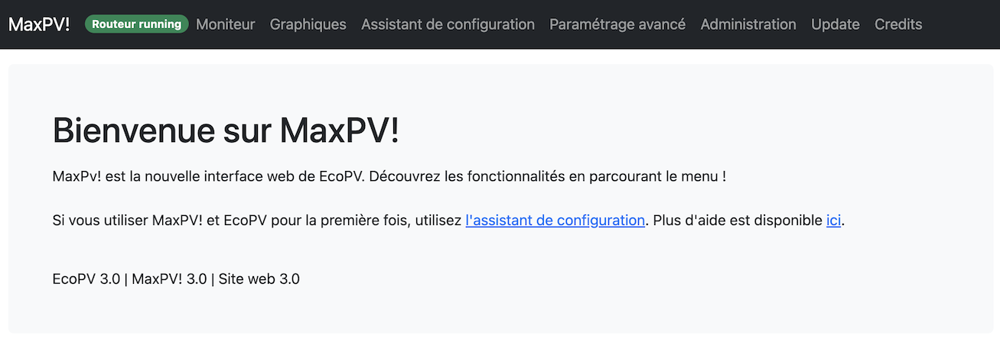
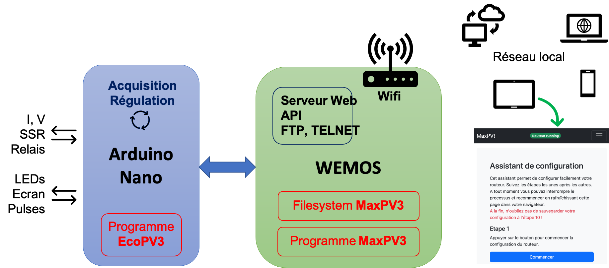
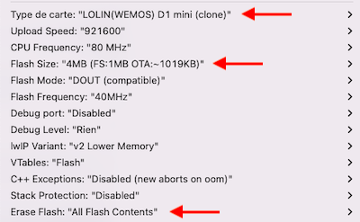
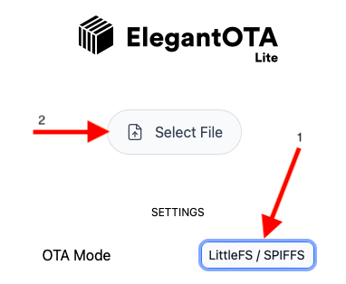
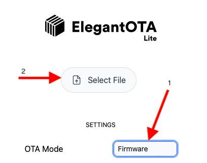
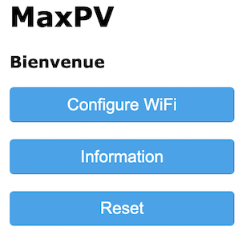
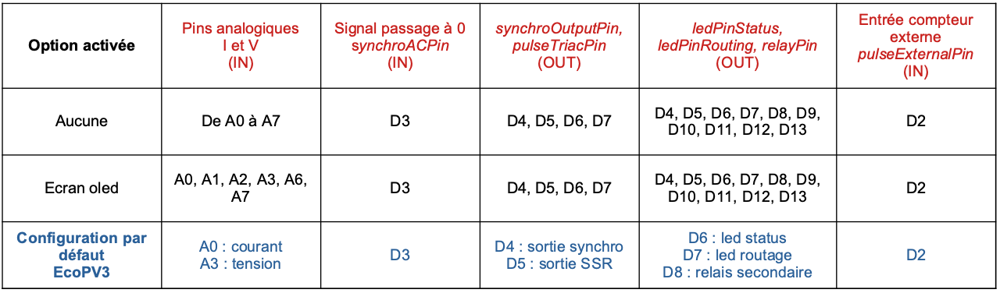

Vous aimez ce projet ? Vous pouvez m'encourager grâce au bouton **Sponsor** dans la barre ci-dessus !
Merci à tous pour vos messages et votre soutien au projet !

# MaxPV!
MaxPV! est une nouvelle interface pour EcoPV, compatible avec les montages EcoPV basés sur l'Arduino Nano et sur le Wemos ESP8266 pour la liaison Wifi. MaxPV! apporte une interface Web de configuration et de visualisation du fonctionnement, ainsi qu'une nouvelle API.

  
MaxPV! hérite d'EcoPV et de son algorithme de routage. Il sera utile de se référer au dépôt EcoPV : https://github.com/Jetblack31/EcoPV

La lecture de ces fils de discussion est plus que recommandée pour la mise en oeuvre :  
* Forum photovoltaïque, discussion sur MaxPV : https://forum-photovoltaique.fr/viewtopic.php?f=110&t=55244 
* Forum photovoltaïque, discussion sur EcoPV : https://forum-photovoltaique.fr/viewtopic.php?f=110&t=42721  
* Forum photovoltaïque, réalisation d'un PCB : https://forum-photovoltaique.fr/viewtopic.php?f=110&t=42874  
* Forum photovoltaïque, montage du PCB : https://forum-photovoltaique.fr/viewtopic.php?f=110&t=43197  

## Mise en garde  
Les programmes et les schémas proposés ont une vocation informative et pédagogique. Ils ont été testés avec succès par les auteurs. Cependant les auteurs de ces programmes et de ces schémas déclinent toute responsabilité. Les auteurs ne pourraient être tenus pour responsables du fonctionnement et des conséquences de l'utilisation des programmes et des schémas mis à disposition.  
Intervenir sur des circuits électriques est dangereux et nécessite le recours à une personne qualifiée et le respect strict des normes de sécurité et de protection en vigueur.

## Caractérisitiques de MaxPV!
* Même qualité de routage du surplus photovoltaïque que EcoPV.
* Interface web responsive avec visualisation graphique des données.
* Support pour MQTT et autodiscovery Home Assistant.
* Installation et paramétrage réseau facilitée.
* Mise à jour du Wemos en OTA.
* Assistant de configuration des paramètres du routeur.
* Le SSR et le relais secondaire de délestage peuvent être forcés sur arrêt permanent, marche permanente, en plus du mode automatique (par défaut).
* Mode Boost sur SSR pour complément de chauffe
* API pour communiquer avec un serveur domotique : [Documentation API](Documentation%20API/API_MaxPV.pdf).

## Synoptique

# Installation
## Pré-requis
L'installation de MaxPV! se fait par programmation de l'Arduino Nano et du Wemos/ESP8266 par USB. Vous aurez besoin d'utiliser l'IDE Arduino avec le support pour les cartes ESP8266.
Le fonctionnement de MaxPV! nécessite une connexion à votre réseau local en Wifi avec une adresse IP statique. En cours d'installation, vous aurez besoin de vous connecter temporairement en Wifi au Wemos à l'aide d'un ordinateur portable ou d'un téléphone.

## Programmation de l'Arduino Nano
* **ATTENTION** : si vous migrez un système EcoPV existant, prenez note des paramètres du routeur ! Ceux-ci seront effacés et devront être ré-introduits à la fin de l'installation !
* Ouvrez le programme *EcoPV3.ino* dans l'IDE de l'Arduino configuré pour la programmation de l'Arduino Nano.
* Si vous utilisez l'écran oLed, dé-commentez la ligne 47 du code et vérifiez que la bibliothèque SSD1306Ascii est bien installée.
* Si vous voulez que l'énergie délivrée en mode FORCE et en mode BOOST ne soit pas prise en compte dans l'index d'énergie routée, modifiez la ligne 65.
* Téléchargez le programme dans l'Arduino Nano.

## Programmation du Wemos
* Configurez l'IDE Arduino sur la carte "Wemos D1 mini clone" avec les paramètres suivants : 
  * **Flash size: 4 MB (FS: 1MB, OTA: 1019KB)**,
  * **Erase Flash: All Flash Contents**

* Installez la librairie **AsyncElegantOTA** à partir du gestionnaire de librairies.
* Installez les 2 librairies disponibles dans le répertoire **"Librairies IDE"**.
* Ouvrez le programme *amorceESP.ino* et téléchargez le dans le Wemos.
* A l'aide d'un ordinateur connectez-vous au réseau Wifi MaxPV créé par le Wemos et allez à la page http://192.168.4.1
* Une page intitulée elegantOTA s'ouvre à l'écran.
* Téléchargez d'abord le **Filesystem** *MaxPV3_filesystem.bin* disponible dans le répertoire **"Binaires MaxPV"**.

* Le Wemos reboote, connectez-vous de nouveau au réseau Wifi MaxPv.
* Téléchargez ensuite le **Firmware** *MaxPV3_firmware.bin* disponible dans le répertoire **"Binaires MaxPV"**.

* Le Wemos reboote, connectez-vous de nouveau au réseau Wifi MaxPv.
* Un portail captif s'ouvre, s'il ne s'ouvre pas automatiquement, connectez-vous à l'adresse http://192.168.4.1

* Réalisez votre configuration Wifi et votre configuration IP. Pour la passerelle, indiquez l'adresse de votre 'Box internet'. Pour les serveurs DNS, indiquez l'adresse de votre 'Box internet' comme adresse DNS1, et indiquez l'adresse 8.8.8.8 pour DNS2 (8.8.8.8 correspond au service DNS de Google). Cela doit convenir à la plupart des installations domestiques. Note : Certaines 'Box internet' ont l'adresse 192.168.1.1, d'autres 192.168.1.254, 192.168.0.254 ou encore 192.168.0.1.
* Vous pouvez maintenant ré-installer l'Arduino Nano et le Wemos sur la carte électronique de votre routeur.
.
## Premier démarrage
* Vérifiez que votre ordinateur / téléphone est bien connecté à votre réseau local.
* Connectez-vous à l'adresse IP statique que vous avez attribuée au Wemos au cours de l'installation.
* La page d'accueil de MaxPV! s'ouvre. Vous pouvez vérifiez que l'Arduino Nano fonctionne correctement par l'indication **Routeur running** en haut de la page.
* Si vous êtes nouvel utilisateur de MaxPV!, rendez-vous sur la page **Assistant de configuration** et laissez-vous guider.
* Si vous voulez entrer manuellement les paramètres du routeur que vous utilisiez précédemment :
  * Rendez-vous sur la page **Paramètrage avancé**,
  * Entrez vos paramètres un par un, en validant chaque paramètre,
  * **Attention** : il y a 2 nouveaux paramètres :
    * **P_INSTALLPV** : puissance de votre installation photovoltaïque en Wc,
    * **CNT_CALIB** : poids des impulsions en Wh du compteur d'impulsion pour la mesure de la production PV,
  * Mettez à 0 les index des compteurs.
  * **Enregistrez la configuration et redémarrez le routeur**.
* Votre routeur MaxPV! est maintenant opérationnel !
* A tout moment, vous pouvez modifier les paramètres du routeur en utilisant de nouveau l'assistant de configuration ou en utilisant le paramétrage avancé.

## Mises à jour
Les mises à jour de l'Arduino se font par USB comme décrit ci-dessus dans l'installation.

Les mises à jour de MaxPV! sur le Wemos se font par Wifi en OTA via la page **Update** de l'interface. **Attention** : la mise à jour du filesystem nécessitera de reconfigurer la connexion Wifi du Wemos comme décrit précédemment : se connecter au réseau Wifi MaxPV puis accéder au portail à l'adresse 192.168.4.1. A partir de la version 3.5, Le Wemos doit être placé sur le PCB avec l'Arduino Nano pour que l'interface MaxPV soit accessible.

Pour les mises à jour, **l'ordre à suivre est** : mise à jour du firmware puis du filesystem. En cas d'échec de la mise à jour, utilisez la procédure Programmation du Wemos ci-dessus.

## Installation avancée
Si vous souhaitez compiler le firmware et le filesystem du Wemos pour réaliser une installation personnalisée, les codes sources sont disponibles dans le répertoire **"MaxPV3"**.

# Tech zone
## Explication du mode de fonctionnement des sorties SSR et du relais secondaire
Le mode de fonctionnement normal des sorties SSR et relais secondaire est le **mode AUTO**. Dans ce mode, le routeur s'occupe de diriger le surplus de production photovoltaïque vers la résistance du chauffe-eau et la charge secondaire de délestage éventuellement connectée au relais. 
Toutefois, vous pouvez forcer la marche du SSR et/ou du relais, il vous suffit de sélectionner le mode FORCE dans l'onglet Moniteur de MaxPV! ou via une requête API. De même, vous pouvez empêcher le fonctionnement du SSR et/ou du relais en sélectionnant le mode STOP.

**ATTENTION** : il y a une limitation au fonctionnement. Le mode AUTO du relais ne peut fonctionner que si le SSR est en mode AUTO. Si le SSR n'est pas en mode AUTO et si le relais est en mode AUTO, alors le relais sera desactivé en permanence.
La modification du mode de fonctionnement du SSR est prioritaire sur le mode BOOST : Toute modification du mode de fonctionnement du SSR entraine l'arrêt automatique du mode BOOST si celui-ci était actif.

## Mode BOOST
Le mode BOOST permet de déclencher le fonctionnement du SSR (résistance du chauffe-eau) pour une durée déterminée et avec une puissance déterminée par configuration dans le menu Administration. Le mode BOOST se déclenche dans le menu Moniteur. Si une nouvelle demande BOOST est effectuée pendant que le mode BOOST est déjà actif, la durée de fonctionnement est ré-initialisée à la valeur de configuration. Le mode BOOST peut être interrompu en cliquant sur le bouton correspondant. A l'arrêt du mode BOOST, la gestion du SSR passe en mode AUTO. Le pilotage de la résistance du chauffe-eau en mode BOOST est de type 'burst PWM' ou modulation de largeur d'impulsion, sur une période de 5 minutes. Ce n'est donc pas un pilotage proportionnel de type gradateur piloté en phase afin de limiter l'échauffement du SSR.
Un déclenchement horaire programmé du mode BOOST est également configurable. La référence horaire pour cette programmation est l'heure solaire de France (= UTC) !

## API
L'API permet d'interfacer MaxPV! avec des systèmes externes comme un système de domotique. L'API a été revue en profondeur comparativement à la version précédente de EcoPV. L'API est décrite dans la [Documentation API](Documentation%20API/API_MaxPV.pdf).

## MQTT
Un broker MQTT est configurable dans l'administration du système. L'authentification est optionnelle, laisser les champs vides si le broker ne nécessite pas d'authentification. Les données sont transmises sur les canaux tels que 'maxpv/pact', 'maxpv/pimpulsion', 'maxpv/prouted' etc... Le service MQTT supporte l'autodiscovery au format Home Assistant. Des informations de fonctionnement du Wemos sont également fournies sur le canal 'maxpv/SYS'.

## Accès au système de fichiers par FTP
Vous pouvez accéder au système de fichiers du Wemos par connexion FTP sur le port 21. L'identifiant est *maxpv*, mot de passe *maxpv*. ATTENTION : le serveur ne supporte qu'une seule connexion simultanée, veillez à configurer votre client FTP en conséquence. Depuis la version 3.5, l'accès FTP est disponible en option de compilation du firmware du Wemos.

## Accès TELNET
Un accès TELNET est disponible sur le port 23. Vous aurez alors accès à des informations de debug, en particulier l'échange de messsages de l'Arduino Nano vers le Wemos. L'accès TELNET est supprimé depuis la version 3.5.

## Allocation des pins de l'Arduino Nano
Les pins d'entrée-sortie de l'Arduino Nano sont configurables dans le code EcoPV3 en fonction du développement de votre circuit électronique. Il y a toutefois certaines contraintes résumées dans le tableau ci-dessous.

# Versions
### **V 3.51** - 21/01/2023
* Prise en compte de l'énergie routée en mode FORCE selon une option de compilation du programme Arduino Nano
* Amélioration de la gestion de l'écran Oled.
* Correction d'un effet de bord en cas de demande de redémarrage de l'Arduino Nano.
* Amélioration du site Web. Retour d'état des boutons en page d'accueil.
* L'absence de réponse de l'Arduino Nano n'est plus bloquante pour le démarrage du Wemos et du site Web.
* Corrections diverses.
### **V 3.5** - 15/01/2023
* Réorganisation du code MaxPV!. Fonctionnement à 160 MHz au lieu de 80 MHz. Optimisation de l'utilisation mémoire et de la vitesse de fonctionnement.
* Suppression de l'accès TELNET. Accès FTP possible en option de compilation.
* Informations de fonctionnement du Wemos disponibles en MQTT.
* Amélioration de l'interface Web.
* Amélioration de la gestion du mode BOOST. Gestion correcte du changement de mode SSR en cours de mode BOOST.
* Ajout d'un index de comptage du temps de fonctionnement du relais.
* Modification de la logique de comptage de l'énergie routée : L'énergie routée en mode FORCE est comptabilisée.
* Supression d'un bug mineur au re-démarrage à chaud de l'Arduino Nano.
### **V 3.35** - 23/11/2022
* Correction de bugs Auto-discovery MQTT Home Assistant. Intégration des compteurs d'énergie au panneau Energie de Home Assistant (Merci à zenman94). 
* Ajout d'un mode sombre au thème du site Web MaxPV! (Merci à Grubuntu).
* Améliorations mineures diverses.
* Versions : MaxPV! 3.35, site Web 3.35, EcoPV 3.31.
### **V 3.32** - 11/11/2022
* MQTT version complète. Support Auto-discovery MQTT Home Assistant (Merci à zenman94)
* Corrections et ajouts dans l'interface web (Merci à Grubuntu)
* Avertissement de mise à jour amélioré. Découplage des 3 MAJ.
### **V 3.31** - 05/11/2022
* Transmission MQTT authentifiée (optionnelle). Ajout de données transmises en MQTT
* Programmation horaire du mode BOOST
* Correction de bugs (restauration configuration)
### **V 3.3** - 01/11/2022
* Ajout de la transmission de données par MQTT (expérimental)
* Possibilité de sauvegarder et de restaurer la configuration MaxPV!
### **V 3.2** - 28/10/2022
* Ajout du mode BOOST programmable en durée et en puissance
### **V 3.11** - 23/10/2022
* Amélioration du comptage des impulsions externes (mesure puissance PV)
* Petites corrections dans MaxPV3
### **V 3.1** - 13/08/2022
* Petites corrections dans EcoPV
* Ajout du graphique historique par pas de 30 minutes sur 4 jours (96h) dans MaxPV!
* Ajout de fonctionnalités à l'API
### **V 3.0.2** - 08/08/2022
* Amélioration du traitement de la liaison série dans EcoPV
* Ajout d'un bargraph dans l'assistant de calibrage
* Optimisation du site Web
* Ajout de la vérification d'une mise à jour disponible sur la page d'accueil
### **V 3.0.1** - 31/07/2022
* Correction d'un bug mineur mode STOP SSR
* Ajout de graphiques
### **V 3.0**   - 30/07/2022
* Version initiale

